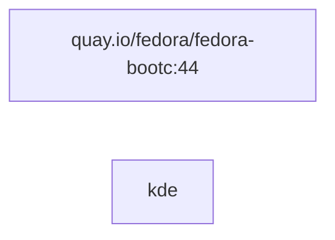

# Creating a bootc image

This tutorial teaches how the repository and schema work by building two
workstation images from the same requirements. It starts with the familiar
components of container building, a script the Containerfile runs and a file
tree copied into the image, and then introduces the schema features that
describe the same work declaratively.

The tutorial is a thorough starting point, not the fastest way to a working
image. Use `tect create repo` to scaffold a repository with sensible defaults
in one command.

## What will you build?

This tutorial creates a repository that generates two workstation images with
different methods. Each workstation includes:

- fedora-bootc:44 as the base image
- KDE Plasma desktop environment
- Firefox browser
- Flatpak and a Flatpak app (Bazaar, a Flatpak app store)

Workstation-1 is hand-written. Its module holds a Bash script to run commands
and a file tree to copy into the image, exactly as a Containerfile would.

Workstation-2 implements the same configuration with the built-in commands. It
uses a module library and a module manifest, which add declarative, family
aware, dependency checked behaviour.

The last part of the tutorial builds the image locally and in CI, producing a
signed image.

> [!NOTE]
> The tutorial creates its own keys and fetches the `tectonic-modules`
> library. Run it somewhere disposable.

## Create the repository

First, create a Tectonic repository from scratch. The basic repository
structure looks like this:

```text
tect-tutorial/
├── .gitignore
├── modules/
├── image.kdl
└── repo.kdl
```

Navigate to a location where you would like to create this repository and run
the following commands:

```sh
mkdir tect-tutorial
cd tect-tutorial
tect create git
touch repo.kdl image.kdl
mkdir modules
```

Below is a summary of each file and directory:

- `repo.kdl` defines repository-wide configuration such as the schema version,
  the sources for base images and module libraries, the security policy and the
  CI workflows.
- `image.kdl` or `<name>.image.kdl` files define the recipe for an image and its
  flavours: the image's identity, its base image, the modules it includes and
  its installation settings.
- `modules/` holds the modules you create. A module is any directory under
  `modules/`.

This is the minimal file and directory structure for a repository. The
documentation provides the full [repository
layout](https://tectonic-os.github.io/tectonic/schema/repository/) schema.

> [!NOTE]
> `tect create git` puts the directory under git control and writes the
> `.gitignore` this repository keeps, which ignores `keys/private/`, `out/`
> and `modules/.remote/`. A directory that is already inside a git repository
> is refused, because a repository does not nest.

> [!NOTE]
> `tect create repo` scaffolds a repository with configuration defaults. This
> tutorial deliberately introduces features one line at a time, so you can
> build an image repository with as much or as little schema as you choose.

## Writing `repo.kdl`

Add the following to `repo.kdl`:

<!-- kdl-file: repo.kdl -->
```kdl
schema-version 1
```

`schema-version` is the only required field. The
[repo.kdl](https://tectonic-os.github.io/tectonic/schema/repo/) documentation
lists every property that this file can hold.

## Creating image definitions

Images are defined with `image` nodes in `image.kdl` or `<name>.image.kdl`
files.

### Writing an `image.kdl` file

Add the following to `image.kdl` in the repository root:

<!-- kdl-file: image.kdl -->
```kdl
schema-version 1

image {
    name "workstation-1"
    base "quay.io/fedora/fedora-bootc:44"
    modules {
    }
}
```

> [!NOTE]
> `tect` parses every `image.kdl` and `<name>.image.kdl` file at the root of
> the repository, and reads the `image` nodes within them. The filenames are
> purely decorative and allow the repository organisation that suits you:
>
> - `image.kdl` is sufficient for a single image.
> - A repository that builds several images can use named files, such as
>   `fedora-workstation.image.kdl` and `debian-workstation.image.kdl`.
> - The filenames can group images by category, such as `servers.image.kdl`
>   and `iot.image.kdl`, where each file contains several related images.

### `image` nodes

An `image` node defines a single image and its flavours.

Within the image node there are the following required nodes:

- `name` is the os-release name of the image.
- `base` is a node that defines the base image.
- `modules` is a node that lists the modules included in the image.

The [image](https://tectonic-os.github.io/tectonic/schema/image/) schema in
the documentation lists every node that an image node can accept.

### Creating a second image

An easier way to scaffold an image file is to use the `tect create image`
command, which provides prompts to configure and generate an image.

#### Adding a base-images library (optional)

You can name the location of a base image directly. You can also use a
base-images library, which supplies generated properties for each base image
and fills the `base` node for you.

A base-images library is declared in the `sources` node in `repo.kdl`:

<!-- kdl-file: repo.kdl -->
```kdl
schema-version 1

sources {
    base-images "core" {
        url "https://github.com/tectonic-os/library"
        path "base-images/core"
    }
}
```

This uses the default `core` base-images library, which contains definitions
for Fedora, CentOS Stream, RHEL, AlmaLinux, Rocky Linux, Debian and Ubuntu.

> [!NOTE]
> You can define your own base images, or create a base-images library in this
> repository or a separate one. See the
> [bases](https://tectonic-os.github.io/tectonic/schema/bases/) documentation
> for details.

#### Creating an image with the CLI

To skip the prompts, add the image name and a `--base` argument to the
command. Run the following within the repository:

```sh
tect create image workstation-2 --base quay.io/fedora/fedora-bootc:44
```

This generates a new `workstation-2.image.kdl` file using the published
fedora-bootc:44 base image. Because the repository now has two images, `tect`
also records `default-image "workstation-1"` in `repo.kdl`.

If you declared the optional `core` base-images library in the step above, the
`base` node is written with the properties the library holds for that image:

<!-- kdl-fragment -->
```kdl
base "quay.io/fedora/fedora-bootc:44" {
    family "fedora"
    provides "rechunking" "initramfs-generation" "luks-initramfs" "selinux-policy" "ssh" "bootc" "bootupctl" "podman" "crun"
    signed #false
}
```

##### The `base` node

The `family` node allows modules to gate compatibility with different Linux
families. The `provides` node declares capabilities baked into the base image
that modules might require.

## Adding modules

### How modules work

A module is a directory that encapsulates a feature, or a collection of
related features. A module directory can contain Bash scripts, files to copy
into the image, Containerfile fragments and more.

For a module to be included in an image, it must be declared as a `module`
inside the image's `modules` node. A `module` is declared by its path relative
to the `modules/` directory.

> [!NOTE]
> For these module directories:
>
> - `modules/custom-module`
> - `modules/dev/git`
> - `modules/dev/brew`
>
> They are declared in `modules` like this:
>
> <!-- kdl-fragment -->
> ```kdl
> modules {
>     module "custom-module"
>     module "dev/git"
>     module "dev/brew"
> }
> ```

The [module directory
layouts](https://tectonic-os.github.io/tectonic/schema/modules/) documentation
shows every type of file and directory a module can use.

### Creating a module

For this tutorial you will create a new KDE Plasma module.

Create the `kde` module directory:

```sh
mkdir modules/kde
```

Create the module script file `modules/kde/module.sh`:

> [!NOTE]
> `tect generate` picks up `module.sh` and gives it its own `RUN` layer in the
> generated `Containerfile`.

Edit `modules/kde/module.sh` and add the following command, which installs
KDE Plasma from the Fedora base image's package manager:

```sh
dnf5 install -y plasma-desktop
```

A module can also ship a file tree. Everything under a module's `files/`
directory is copied into the image at the same path. Create a default user
configuration:

```sh
mkdir -p modules/kde/files/etc/skel/.config
```

and write `modules/kde/files/etc/skel/.config/kdeglobals`:

```ini
[General]
ColorScheme=BreezeDark
```

During the build, this tree is copied into the image at the same path, so
`modules/kde/files/etc/skel/.config/kdeglobals` lands at
`/etc/skel/.config/kdeglobals`. The generated module script does the copy with
`cp -rT /ctx/modules/kde/files /`.

Include the `kde` module in the `workstation-1` image node in `image.kdl`:

<!-- kdl-file: image.kdl -->
```kdl
schema-version 1

image {
    name "workstation-1"
    base "quay.io/fedora/fedora-bootc:44"
    modules {
        module "kde"
    }
}
```

#### Importing a module from a library

Rather than writing every module from scratch, you can import or copy existing
modules from a library to add features quickly and avoid duplicating code.

The default modules library provides feature modules for many use cases.

To add the default modules library to your repository, edit `repo.kdl` and add
it to the `sources` node:

<!-- kdl-file: repo.kdl -->
```kdl
schema-version 1

sources {
    base-images "core" {
        url "https://github.com/tectonic-os/library"
        path "base-images/core"
    }
    capabilities "core" {
        url "https://github.com/tectonic-os/library"
        path "capabilities"
    }
    modules "tectonic-modules" {
        url "https://github.com/tectonic-os/library"
        path "modules"
    }
}

default-image "workstation-1"
```

Now run:

```sh
tect import module
```

You will be prompted with a populated list of modules from the default module
library. Scroll to the `desktop-environment` section, expand it with the →
key, and toggle `kde-plasma` with the space bar:

```ansi
Which modules?
  [ ] ▸ browsers
  [-] ▾ desktop-environment
    [ ] tectonic-modules/desktop-environment/gamemode
    [ ] tectonic-modules/desktop-environment/gnome
  > [x] tectonic-modules/desktop-environment/kde-plasma
    [ ] tectonic-modules/desktop-environment/krunner-bazaar
  [ ] ▸ fedora
  [ ] ▸ hardening
↑↓ navigate • ←/→ open • ␣ toggle • ⏎  confirm • Esc cancel
```

At the next prompt, select `workstation-2` and press enter to confirm:

```ansi
Which images list it?
  [ ] workstation-1
> [x] workstation-2
↑↓ navigate • ␣ toggle • ⏎  confirm • Esc cancel
```

You will then be prompted to add the `build-environment` that this module
depends on. This is explained later in the [Module
manifests](#module-manifests) section. Select Yes:

```ansi
The selected modules have dependencies not currently provided by the images:

  kde-plasma > fedora-bootc:44
    requires: build-environment
    provider module: fedora/build-environment

Add these provider modules now?
> Yes
  No
↑↓ navigate • ⏎  confirm • Esc cancel
```

This modifies `workstation-2.image.kdl` to include two imported modules:

<!-- kdl-file: workstation-2.image.kdl -->
```kdl
schema-version 1

image {
    name "workstation-2"

    base "quay.io/fedora/fedora-bootc:44" {
        family "fedora"
        provides "rechunking" "initramfs-generation" "luks-initramfs" "selinux-policy" "ssh" "bootc" "bootupctl" "podman" "crun"
        signed #false
    }

    layout {
        bootloader "grub2"
    }

    modules {
        source "tectonic-modules" {
            module "fedora/build-environment"
            module "desktop-environment/kde-plasma"
        }
    }
}
```

Imported modules are placed inside a `source` node named for the library they
came from.

Notice that a `modules/.remote/tectonic-modules` directory now exists. It is
an untracked fetch cache, under a directory named for the library source, and
not an editing surface. `tect generate` refreshes an unpinned module from the
library; use `tect copy module` before modifying one.

#### Copying modules from a library

If you wish to modify a module from a library, use `tect copy module`. It
works the same as `tect import module`, except that it saves an unlinked copy
under `modules/` and adds it to image files like a module you wrote yourself.
A `provenance.kdl` beside the copy records where it came from.

#### Module manifests

Looking at `modules/.remote/tectonic-modules/desktop-environment/kde-plasma`,
you will see it contains a `module.kdl` file. This is a module manifest. It
includes the following nodes:

<!-- kdl-fragment -->
```kdl
supports "fedora" "debian" "ubuntu"

provides "plasma-desktop" "display-manager" "graphical-session" "wayland"

requires "build-environment"

packages "plasma-desktop" "plasma-workspace" "plasma-nm" "dolphin" "konsole" "kate"
// and the rest of the Plasma application set

family "fedora" {
    packages "plasma-login-manager" "kcm-plasmalogin" "kwin" "kscreenlocker"
}

family "ubuntu" {
    packages "plasma-session-wayland" "plasma-session-x11"
}

family "debian" {
    packages "systemsettings" "sddm" "kwin-wayland"
}
```

##### Manifest fields

- **supports** restricts this module to the base-image families it lists.
- **provides** and **requires** name capabilities a module provides or needs
  from other modules. For example, a GUI app can declare that it requires a
  `display-manager`, and modules that add a display manager can declare that
  they provide it.
- **packages** resolves to the base image's package manager, which the
  `build-environment` module supplies for each family.
- **family "fedora|rhel|debian|ubuntu"** gates any of the module's top-level
  configuration for one or more families, so a module can handle the
  differences between them.

### Creating a module with the CLI

You can create modules with the built-in `tect create module` command, which
scaffolds a package module.

Create a module named `browser`, which installs the `firefox` package:

```sh
tect create module
```

The command prompts for a name, an optional description and supported
families, then asks whether the module installs a package and which images
list it:

```ansi
module name: browser

description (optional):

supported base families, separated by spaces (optional):

Does this module install packages? Yes

package names, separated by spaces: firefox

Which images list it?
  [ ] workstation-1
> [x] workstation-2
↑↓ navigate • ␣ toggle • ⏎  confirm • Esc cancel
```

Alternatively, you can configure a module with command arguments:

```sh
tect create module browser --image workstation-2 --pkg firefox
```

#### `create module` arguments

**`--image`**: lists the new module in the named image.
**`--pkg`**: adds these package names to the module.
**`--no-tui`**: asks nothing; a command that would prompt fails and names the
flag. Use it in scripts with all arguments supplied.

Review the `module.kdl` file in `modules/browser/`:

<!-- kdl-file: module.kdl -->
```kdl
schema-version 1

packages "firefox"
```

#### Declaring dependencies

A missing dependency is expensive to catch during the image build or at
runtime.

Declaring `provides` and `requires` in a module's `module.kdl` manifest lets
`tect` catch them before the build files are generated.

Since Firefox is a GUI app, it requires a graphical session. Add the following
line to `modules/browser/module.kdl`:

<!-- kdl-file: module.kdl -->
```kdl
schema-version 1

packages "firefox"

requires "graphical-session"
```

If you temporarily remove `kde-plasma` from the image file and run `tect check`
or `tect generate`, `tect` reports the missing dependency immediately:

```
  × `browser` requires `graphical-session`, which nothing enabled provides
   ╭─[./modules/browser/module.kdl:5:1]
 4 │
 5 │ requires "graphical-session"
   · ────┬───
   ·     ╰── unsatisfied
   ╰────
  help: no module in the repository or its collections declares `provides
        "graphical-session"`, and neither does the `base` node in
        ./workstation-2.image.kdl
```

### Hook modules

The modules so far add features to the image. A module can also add
functionality to the `tect` tool itself and to the generation stage.

#### Key hook

A module can hook into the key generator, `tect create key`, and add new key
pairs with the `key` node in its `module.kdl` file. The private key then goes
into a secrets vault, and the public key is installed at the location the
module declares in the image.

The `key` node takes these fields:

<!-- kdl-fragment -->
```kdl
key "cosign" {
    generator "cosign"
    public "/etc/pki/containers/cosign.pub"
    private "cosign.key"
}
```

`generator` is one of `cosign`, `openssl` or `ssh-keygen`.

Add the signature-policy module, `updates/signature-policy`, to the image
with:

```sh
tect import module updates/signature-policy --image workstation-2
```

then create the cosign keys with:

<!-- transcript-command: tect create key cosign -->
```sh
tect create key cosign
```

This prints:

<!-- transcript-output: tect create key cosign -->
```bash
Private key written to cosign.key
Public key written to cosign.pub
wrote keys/public/etc/pki/containers/cosign.pub
wrote keys/private/cosign.key

the key carries no password, which is what the build workflow decrypts it with.

next:
  commit keys/public/etc/pki/containers/cosign.pub
  gh secret set SIGNING_SECRET < keys/private/cosign.key
```

> [!NOTE]
> The `.gitignore` that `tect create git` wrote already ignores
> `keys/private/`. `tect create key` warns when nothing ignores the private
> half.

#### Collection modules

A module can also collect and organise files from the modules it depends on.

For example, a Flatpak module can collect a `flatpaks.list` file from any
module in the image.

Add Flatpak and Bazaar to workstation-2 with:

```sh
tect import module flatpak --image workstation-2
tect import module apps/bazaar --image workstation-2
```

The cached Flatpak `module.kdl` at
`modules/.remote/tectonic-modules/flatpak` holds:

<!-- kdl-fragment -->
```kdl
collects "flatpaks.list" into="/usr/share/flatpak-defaults/apps.list" priority=500

provides "flatpak"
```

The cached Bazaar module at
`modules/.remote/tectonic-modules/apps/bazaar` has a manifest that requires
`flatpak` and `display-manager`, and a `flatpaks.list` file holding:

```text
io.github.kolunmi.Bazaar
```

#### Build helper script modules

A module can provide build helper scripts to every other module with the
`helpers` node in `module.kdl`.

For example, the cached `fedora/build-environment` module provides
`lib/family.sh`, which other modules use to install packages with the right
command for the family.

## Check the repository

Run the check:

```sh
tect check
```

Errors name what is missing.

## Generate and review the build files

```sh
tect generate
```

This creates a `generated` directory. Each image gets a
`generated/<image>/` directory holding its `Containerfile`, its module scripts
under `modules/`, `finalize.sh` and the capability graph (`graph.md`).
`generated/plan.json` records the resolved plan, and `generated/lib/` and
`generated/scripts/` hold the shared helpers and scripts.

`tect graph` prints the capability graph generated at
`generated/workstation-1/graph.md`:

<!-- transcript-command: tect graph -->
```sh
tect graph
```

<!-- transcript-output: tect graph -->
````markdown
# workstation-1 capability graph

GENERATED FILE, do not edit.

An arrow points from a provider to what needs it, dotted for `after`,
which orders the build without requiring anything. Layers build left to
right.


````

`tect summary` prints what the target is made of:

<!-- transcript-command: tect summary -->
```sh
tect summary
```

<!-- transcript-output: tect summary -->
```markdown
1 module, the ungated set.

| Module | Description | Options | Satisfies | Refuses |
| --- | --- | --- | --- | --- |
| `kde` |  |  |  |  |
```

`tect why bazaar` prints where each part of the Bazaar module came from:

<!-- transcript-command: tect why bazaar -->
```sh
tect why bazaar
```

<!-- transcript-output: tect why bazaar -->
```markdown
# tectonic-modules/apps/bazaar

Bazaar, the Flatpak storefront

## Where it is built

workstation-2

## What it exchanges

| Direction | What | With |
| --- | --- | --- |
| provides | `bazaar` | nothing |
| requires | `flatpak` | tectonic-modules/flatpak |
| requires | `display-manager` | tectonic-modules/desktop-environment/kde-plasma |

## What it claims

Nothing. It declares no `satisfies`.

## Where it came from

| Content | Hash |
| --- | --- |
| declared | `8d53093c778d20bac559dc9697fd2507c6891af5ffb754c8717402c3fd4c171e` |

| Collection | Locator | Selector | Verifier | Tracker |
| --- | --- | --- | --- | --- |
| `tectonic-modules` | https://github.com/tectonic-os/library | not declared | not declared | unpinned |

It is referenced rather than copied, so what a build reads is the collection's own tree at that pin.

## What it pulls in

Nothing. It declares no `asset`.

## Third-party repositories

None. It declares no `copr` and ships no `repo` file.
```

## Build the image

To build the image run:

<!-- transcript-command: tect build -->
```sh
tect build
```

`tect build` verifies the generated files, then builds the default image. Name
another target, such as `tect build workstation-2`, to build it instead. With
the default buildah backend, the image lands in the local Podman store. The
walkthrough's default tag is printed before the build starts:

<!-- transcript-output: tect build -->
```text
tect: tags workstation-1:latest
```

Once `IMAGE_REGISTRY` is set, or the repository has a GitHub `origin`,
`tect registry ref` prints the full reference the image publishes under. For
example:

<!-- transcript-command: IMAGE_REGISTRY=ghcr.io/example tect registry ref -->
```sh
IMAGE_REGISTRY=ghcr.io/example tect registry ref
```

<!-- transcript-output: IMAGE_REGISTRY=ghcr.io/example tect registry ref -->
```text
ghcr.io/example/workstation-1:latest
```

## Publish with CI

`tect set workflows` chooses the GitHub Actions workflows and writes them into
`repo.kdl`. Pick `build`, the workflow that builds and publishes the image.
`tect generate` then writes `.github/workflows/build.yml`. Push the repository
to GitHub, and the workflow builds the image, pushes it to
`ghcr.io/<owner>/<image>`, signs the digest with the key from
`SIGNING_SECRET`, attests its SBOM, and runs the scans. The schedule in the
workflow comes from `at=`, the image version comes from the build, and
`tect registry namespace` prints the namespace the image publishes under.
[repo.kdl](schema/repo.md#workflows) documents the block.
